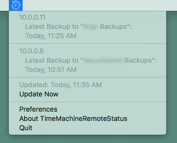

# About

TimeMachineRemoteStatus is a macOS app for displaying the Time Machine status of remote Macs in the menu bar.

# Usage

Go to Preferences and add one or more IP addresses or hostnames corresponding to a remote Mac that has Time Machine enabled. You must have SSH access to the host using public key authentication. You may need to tweak your `~/.ssh/config` file.
